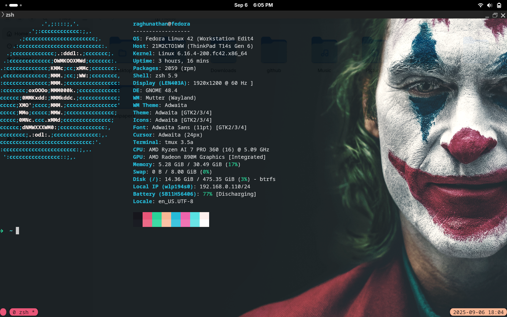
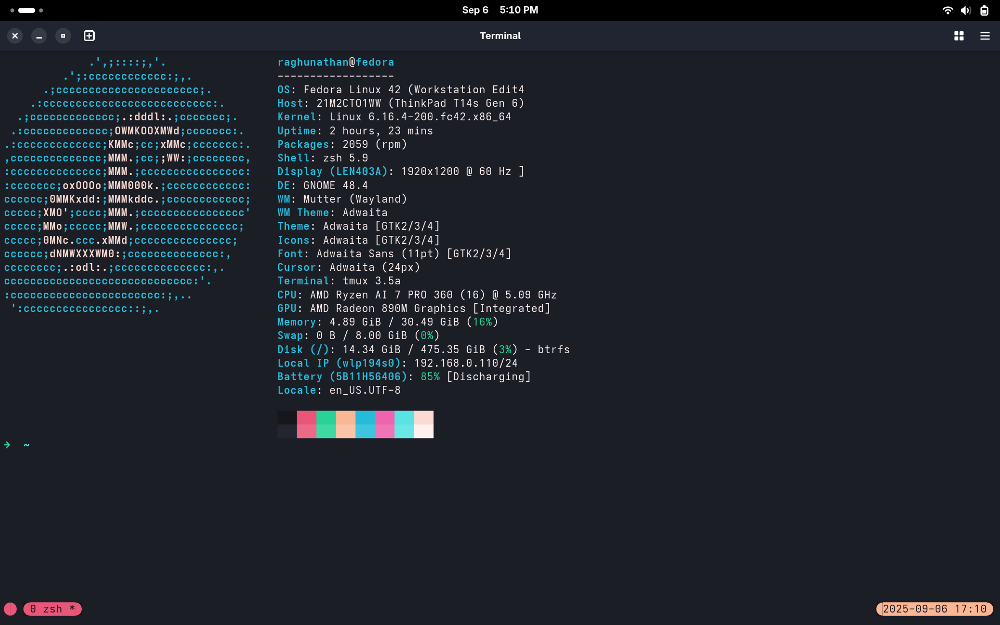

# dotfiles
Collection of my personal dotfiles and setup

Preview of the setup.

## Kitty

## Ptyxis

## TODO

Create a installer script which will install the software and copy the configuration on a fedora machine. The steps are as follows.

- install zsh
- install oh-my-zsh
- copy startup.sh
- copy ~/.zshrc

- install tmux
- copy ~/.tmux.conf

- install nvim
- install vim-plug
- copy ~/.config/nvim/init.vim

- install kitty
- copy ~/.config/kitty/kitty.config
